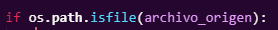

### Importacion de librerias necesarias.

-- os : Para interactuar con el sistema.
-- shutil : Para copiar archivos y directorios.

### Definición de función para copiar los archivos de video.

-- La funcion copia todos los 'archivos de video' que encuentre en el directorio origen, 
al directorio destino.

### Comprobación de existencia de directorios.

-- Se comprueba si existe la ruta del directorio origen ingresada.

-- Se comprueba si existe la ruta del directorio destino ingresada, si no existe se crea.

### Obtención de los archivos dentro del directorio origen.

Obtención de todos los archivos dentro del directorio origen:

Definicion de una tupla de extensiónes de archivos de video comunes.

### Iteración

-- Se itera sobre cada archivo.
-- Obteniendo la ruta completa del archivo en el directorio origen.

ej: 'video1.mp4' es la parte que va a variar todo el tiempo.

-- Se comprueba si es un archivo y no un subdirectorio.

-- Se comprueba si el archivo tiene una extensión de video válida.

-- Si es un archivo de video valido, se copia al directorio destino

### Manejo de excepciones.

-- Copia el 'archivo' del directorio origen al directorio destino.

-- En caso de haber un error, se vizualiza la excepcion.

### Finalmente.

-- Se ejecuta la funcion del script.

